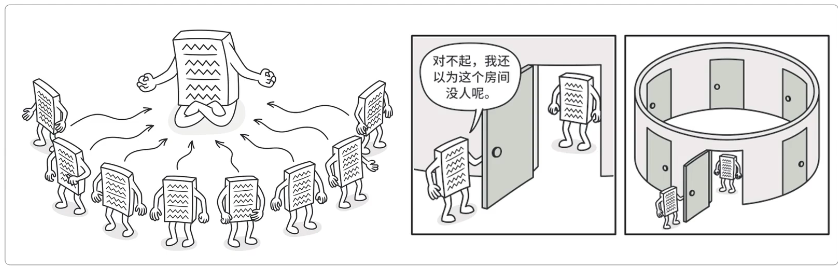

# 单例模式



**单例模式应该满足：**

* 私有构造（防止类被常规方法实例化）
* 以静态方法或者枚举返回实例（保证实例的唯一性）
* 确保实例只有一个，尤其是多线程环境。（保证在创建实例的线程安全）
* 确保反序列化时不会重新构建对象（在有序列化反序列化场景下防止单例被莫名破坏，造成未考虑的后果）

饿汉，懒汉，双重校验锁，内部类等。。

[提供synchronized关键字的使用方法](..\synchronized关键字.md)

## 懒汉式（非线程安全）

```java
public class Singleton_01 {
    private static Singleton_01 instance;

    private Singleton_01() {
    }

    public static Singleton_01 getInstance() {
        if (null != instance) return instance;
        instance = new Singleton_01();
        return instance;
    }
}
```

目前这种方法的单例模式确实满足了懒加载，但如果有多个访问者同时去获取对象实例，可以想象成一堆人去申请厕所，就可能会造成多个实例并存，从而没有达到单例的要求


## 懒汉式（线程安全）

```java
public class Singleton_02 {
    private static Singleton_02 instance;

    private Singleton_02() {
    }

    public static synchronized Singleton_02 getInstance() {
        if (null != instance) return instance;
        instance = new Singleton_02();
        return instance;
    }
}
```

此种模式虽安全，但因为加了锁，所有的访问都需要占用锁，导致资源浪费，如果不是特殊情况，不建议使用此方式实现单例模式


## 饿汉式（初始就线程安全）

```java
public class Singleton_03 {
    private static Singleton_03 instance = new Singleton_03();

    private Singleton_03() {}

    public static Singleton_03 getInstance() {
        return instance;
    }
}
```

这种单例模式初始就能保证线程安全，但也造成其它问题
**他不是懒加载的**，也就是程序无论使用该类否，都会创建，如果一个项目有多个饿汉式，则会导致占用资源问题，就像导致的问题就像你下载个游戏软件，可能你游戏地图还没有打开呢，但是程序已经将这些地图全部实例化。到你手机上最明显体验就一开游戏内存满了，手机卡了，需要换了


## 类的内部类（非常推荐使用）

```java
public class Singleton_04 {

    // 单例持有者
    private static class SingletonHolder {
        private static Singleton_04 instance = new Singleton_04();
    }

    private Singleton_04() {}

    public static Singleton_04 getInstance() {
        return SingletonHolder.instance;
    }
}
```

* 使用类的静态内部类实现单例模式，既保证了线程安全又保证了懒加载，同时不会因为锁耗费性能
* 主要因为JVM虚拟机可以保证多线程并发访问的正确性，也就是一个类的构造方法在多线程环境下可以被正确的加载
* **此种方式也是非常推荐使用的一种单例模式**


## 双重校验锁

```java
public class Singleton_05 {
    private static volatile Singleton_05 INSTANCE;  // 第一重锁

    private Singleton_05() {}

    public static Singleton_05 getInstance() {
        if(null!=INSTANCE) return INSTANCE;
        synchronized(Singleton_05.class){           // 第二重锁
            if(null==INSTANCE)INSTANCE = new Singleton_05();
        }
        return INSTANCE;
    }
}
```

- 双重锁的方式是方法级锁的优化，减少了部分获取实例的耗时。
- 同时这种方式也满足了懒加载。


## CAS实现

```java
/**
 * CAS实现：忙等策略
 */
public class Singleton_06 {

    private static final AtomicReference<Singleton_06> INSTANCE = new AtomicReference<Singleton_06>();

    private Singleton_06() {
    }

    public static final Singleton_06 getInstance() {
        for (; ; ) {
            Singleton_06 instance = INSTANCE.get();
            if (null != instance) return instance;
            INSTANCE.compareAndSet(null, new Singleton_06());
            return INSTANCE.get();
        }
    }

    public static void main(String[] args) {
        System.out.println(Singleton_06.getInstance()); // org.itstack.demo.design.Singleton_06@2b193f2d
        System.out.println(Singleton_06.getInstance()); // org.itstack.demo.design.Singleton_06@2b193f2d
    }

}
```


- java并发库提供了很多原子类来支持并发访问的数据安全性；`AtomicInteger`、`AtomicBoolean`、`AtomicLong`、`AtomicReference`。
- `AtomicReference<V>` 可以封装引用一个V实例，支持并发访问如上的单例方式就是使用了这样的一个特点。
- 使用CAS的好处就是不需要使用传统的加锁方式保证线程安全，而是依赖于CAS的忙等算法，依赖于底层硬件的实现，来保证线程安全。相对于其他锁的实现没有线程的切换和阻塞也就没有了额外的开销，并且可以支持较大的并发性。
- 当然CAS也有一个缺点就是忙等，如果一直没有获取到将会处于死循环中


## Effect Java作者提供的枚举实现单例模式

```JAVA
public enum Singleton_07 {
    INSTANCE;
    public void test(){
        System.out.println("hi~");
    }
}
```

>- Effective Java 作者推荐使用枚举的方式解决单例模式，此种方式可能是平时最少用到的。
>- 这种方式解决了最主要的；线程安全、自由串行化、单一实例。
>
>**调用方式**
>
>```java
>@Test
>public void test() {
>    Singleton_07.INSTANCE.test();
>}
>```
>
>*这种写法在功能上与共有域方法相近，但是它更简洁，无偿地提供了串行化机制，绝对防止对此实例化，即使是在面对复杂的串行化或者反射攻击的时候。虽然这种方法还没有广泛采用，但是单元素的枚举类型已经成为实现Singleton的最佳方法。*
>
>但也要知道此种方式在存在继承场景下是不可用的。