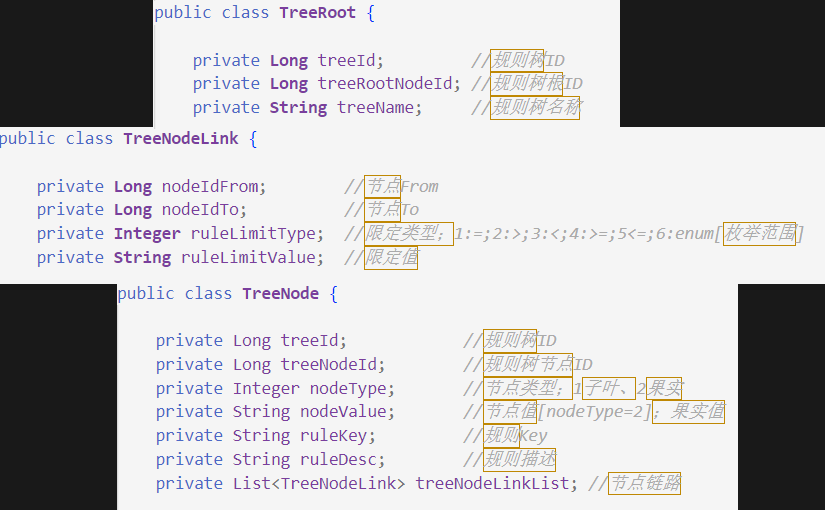
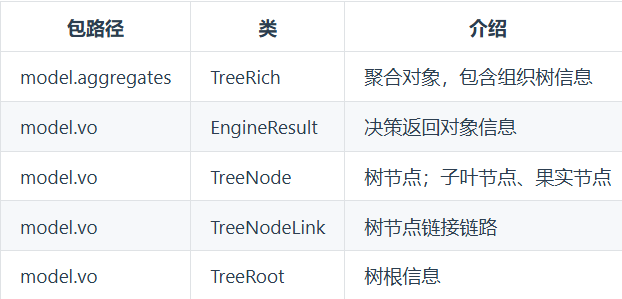

# 组合模式

由有成为屎山代码的tutorials11.0-0 => 更迭为使用组合模式的代码tutorials11.0-1


## 描述

**组合模式：**也称为 整体-部分模式，它的宗旨皆是通过将单个对象（叶子节点）和组合对象（树枝节点）用相同的接口进行表示，使得客户对单个对象和组合对象的使用具有一致性

**构建规则树：**






## 一、核心定义

将对象组织成‌**树形结构**‌表示"整体-部分"关系，使客户端能‌**统一处理**‌单个对象和组合对象‌12

## 二、适用场景

- 需要处理树状数据结构（文件系统/组织架构）
- 需递归处理所有节点（如计算总价）
- 希望客户端不区分叶子与组合对象‌25

## 三、结构组成

| 角色          | 职责                       | Java实现要点            |
| ------------- | -------------------------- | ----------------------- |
| ‌**Component**‌ | 定义统一操作接口           | 接口/抽象类声明通用方法 |
| ‌**Leaf**‌      | 叶子节点（无子元素）       | 实现基础业务逻辑        |
| ‌**Composite**‌ | 容器节点（存储子元素集合） | 维护List<Component>集合 |

## 四、实现步骤

1. ‌**创建抽象组件**‌

```
javaCopy Codepublic interface FileSystemComponent {
    void display(int depth);  // 展示层级结构
    int getSize();            // 获取文件大小
}
```

1. ‌**实现叶子节点**‌

```
javaCopy Codepublic class File implements FileSystemComponent {
    private String name;
    private int size;
    
    public void display(int depth) {
        System.out.println("-".repeat(depth) + "📄 " + name);
    }
    
    public int getSize() {
        return size;
    }
}
```

1. ‌**实现容器节点**‌

```
javaCopy Codepublic class Folder implements FileSystemComponent {
    private List<FileSystemComponent> children = new ArrayList<>();
    private String name;

    public void add(FileSystemComponent item) {
        children.add(item);
    }

    public void display(int depth) {
        System.out.println("-".repeat(depth) + "📁 " + name);
        children.forEach(child -> child.display(depth + 1));
    }

    public int getSize() {
        return children.stream().mapToInt(FileSystemComponent::getSize).sum();
    }
}
```

## 五、透明模式 vs 安全模式

| 类型       | 特点                        | 实现方式                      |
| ---------- | --------------------------- | ----------------------------- |
| ‌**透明式**‌ | 所有方法定义在Component接口 | 叶子节点抛出Unsupported异常‌56 |
| ‌**安全式**‌ | 组合节点特有方法单独定义    | 客户端需做类型判断            |

> 推荐使用‌**透明式**‌实现（符合依赖倒置原则）‌5

## 六、优缺点分析

✅ ‌**优势**‌

1. 简化客户端代码（统一处理逻辑）
2. 方便新增节点类型（开闭原则）
3. 天然支持递归结构‌26

❌ ‌**局限**‌

1. 过度统一接口可能导致方法冗余
2. 组合层级过深时影响性能‌58

## 七、实战应用场景

1. ‌**GUI组件系统**‌：窗口包含面板，面板包含按钮
2. ‌**电商订单系统**‌：订单包裹包含商品和子包裹
3. ‌**XML文档解析**‌：元素节点包含属性和子元素‌46

## 八、扩展练习

尝试实现公司部门薪资统计：

- 部门类（Composite）：计算部门总薪资
- 员工类（Leaf）：存储个人薪资
- 调用部门.getTotalSalary()自动递归统计‌68