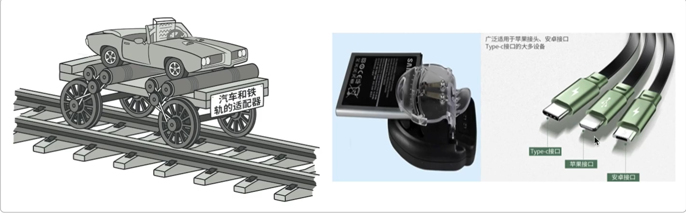

# 适配器模式

代码=》tutorails9.0-0=>tutorials9.0-1

**思想：**适配器模式主要解决的问题就是多种差异化类型的接口做统一输出，这在我们学习工厂方法模式中也有所提到不同种类的奖品处理，其实就是适配器的使用

**图例：**



**满足条件：**

1. **接口不兼容**
   当现有类的接口与客户端期望的接口不一致时，需要通过适配器接口实现以实现兼容性
2. **需要用现有类但接口不匹配**
   若希望复用某些功能完善的类，但其接口不符合当前系统要求，适配器可将其适配到目标接口中，避免直接修改原有代码
3. **需要装适配逻辑**
   当适配过程涉及复杂转换逻辑时，适配器可将此类细节封装在内部，保持客户端代码的简洁性，避免业务逻辑与适配逻辑耦合
4. **多个类需协同工作但接口不同**
   若两个或多个类需协作但接口不一致，适配器可统一接口标准，使其无需修改自身即可协同工作


**举例：**（多种MQ，使用适配器接收）


**具体代码：**需要适配成如下格式的类

```java
public class RebateInfo {
    private String userId;  // 用户ID
    private String bizId;   // 业务ID
    private String bizTime;   // 业务时间
    private String desc;    // 业务描述

    // ...get/set

    public String getUserId() {
        return userId;
    }

    public void setUserId(String userId) {
        this.userId = userId;
    }

    public String getBizId() {
        return bizId;
    }

    public void setBizId(String bizId) {
        this.bizId = bizId;
    }

    public String getBizTime() {
        return bizTime;
    }

    public void setBizTime(String bizTime) {
        this.bizTime = bizTime;
    }

    public String getDesc() {
        return desc;
    }

    public void setDesc(String desc) {
        this.desc = desc;
    }
}
```

使用如下方法类

```java
public class MQAdapter {
    /**
     * 过滤器
     * @param strJson   被适配消息
     * @param link      通用返回信息成员属性 与 被适配消息成员属性的映射
     * @return
     * @throws Exception
     */
    public static RebateInfo filter(String strJson, Map<String,String> link)throws NoSuchMethodException, IllegalAccessException, InvocationTargetException{
        return filter(JSON.parseObject(strJson,Map.class),link);
    }

    public static RebateInfo filter(Map obj,Map<String,String> link)throws NoSuchMethodException, IllegalAccessException, InvocationTargetException {
        RebateInfo rebateInfo = new RebateInfo();
        for(String key:link.keySet()){
            Object val = obj.get(link.get(key));
            RebateInfo.class.getMethod("set"+key.substring(0,1).toUpperCase()+key.substring(1),String.class)
                    .invoke(rebateInfo,val.toString());
        }
        return rebateInfo;
    }
}
```

**总结：**

- 从上文可以看到不使用适配器模式这些功能同样可以实现，但是使用了适配器模式就可以让代码：干净整洁易于维护、减少大量重复的判断和使用、让代码更加易于维护和拓展。
- 尤其是我们对MQ这样的多种消息体中不同属性同类的值，进行适配再加上代理类，就可以使用简单的配置方式接入对方提供的MQ消息，而不需要大量重复的开发。非常利于拓展。
