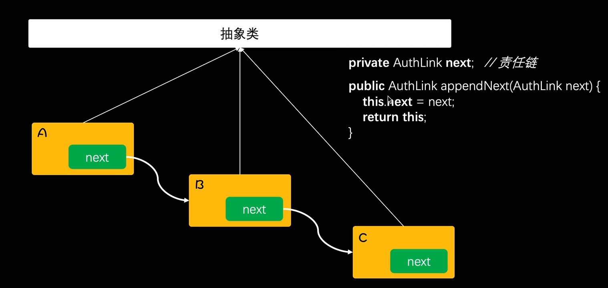

# 责任链模式

**本系列代码在tutorials16系列**


**责任链模式：**为了避免请求发送者与多个请求处理者耦合在一起，于是将所有请求的处理者通过前一对象记住其下一个对象的引用而连成一条链；当有多个请求发生时，可将请求沿着这条链传递，直到有对象处理它为止


## 图例


## 责任链核心




## 模拟场景


### 模拟审核服务

```java
public class AuthService {
    private static Map<String, Date> authMap = new ConcurrentHashMap<String,Date>();

    /**
     * 审核查询结果
     * @param uId
     * @param orderId
     * @return
     */
    public static Date queryUserInfo(String uId,String orderId){
        return authMap.get(uId.concat(orderId));
    }

    /**
     * 处理审核
     * @param uId
     * @param orderId
     */
    public static void auth(String uId,String orderId){
        authMap.put(uId.concat(orderId),new Date());
    }
}
```


### 重构代码


### 模拟测试

```java
@Test
public void test_AuthLink() throws ParseException {
    AuthLink authLink = new Level3AuthLink("1000013", "王工")
            .appendNext(new Level2AuthLink("1000012", "张经理")
                    .appendNext(new Level1AuthLink("1000011", "段总")));

    logger.info("测试结果：{}", JSON.toJSONString(authLink.doAuth("小傅哥", "1000998004813441", new Date())));

    // 模拟三级负责人审批
    AuthService.auth("1000013", "1000998004813441");
    logger.info("测试结果：{}", "模拟三级负责人审批，王工");
    logger.info("测试结果：{}", JSON.toJSONString(authLink.doAuth("小傅哥", "1000998004813441", new Date())));

    // 模拟二级负责人审批
    AuthService.auth("1000012", "1000998004813441");
    logger.info("测试结果：{}", "模拟二级负责人审批，张经理");
    logger.info("测试结果：{}", JSON.toJSONString(authLink.doAuth("小傅哥", "1000998004813441", new Date())));

    // 模拟一级负责人审批
    AuthService.auth("1000011", "1000998004813441");
    logger.info("测试结果：{}", "模拟一级负责人审批，段总");
    logger.info("测试结果：{}", JSON.toJSONString(authLink.doAuth("小傅哥", "1000998004813441", new Date())));
}
```

只要修改各个审批负责人一级审批成效时间，这段代码就可复用了

- 从上述的结果可以看到我们的责任链已经生效，按照责任链的结构一层层审批，直至最后输出审批结束到一级完成的结果。
- 这样责任链的设计方式可以方便的进行扩展和维护，也把if语句干掉了。

## 总结

- 从上面代码从if语句重构到使用责任链模式开发可以看到，我们的代码结构变得清晰干净了，也解决了大量if语句的使用。并不是if语句不好，只不过if语句并不适合做系统流程设计，但是在做判断和行为逻辑处理中还是非常可以使用的。
- 在我们前面学习结构性模式中讲到过组合模式，它像是一颗组合树一样，我们搭建出一个流程决策树。其实这样的模式也是可以和责任链模型进行组合扩展使用，而这部分的重点在于如何关联**链路的关联**，最终的执行都是在执行在中间的关系链。
- 责任链模式很好的处理单一职责和开闭原则，简单了耦合也使对象关系更加清晰，而且外部的调用方并不需要关心责任链是如何进行处理的*(以上程序中可以把责任链的组合进行包装，再提供给外部使用)*。但除了这些优点外也需要是适当的场景才进行使用，避免造成性能以及编排混乱调试测试疏漏问题。
